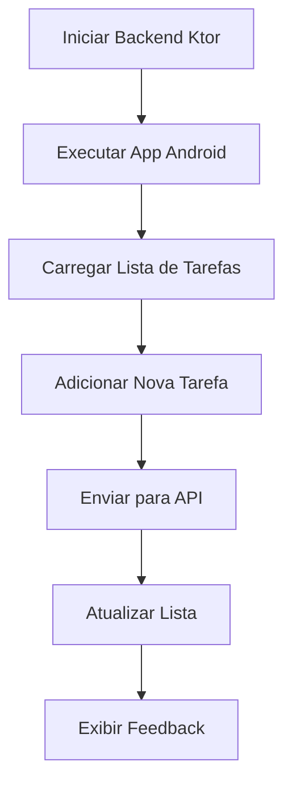

# 🚀 TaskListApp — Aplicação Full Stack de Lista de Tarefas

<p align="center">
  
  
  
  
  
</p>

---

## ✨ Sobre o Projeto

O **TaskListApp** é uma aplicação **Full Stack** desenvolvida para gerenciamento de tarefas, utilizando tecnologias modernas do ecossistema Kotlin e Android.
O projeto integra um **backend com Ktor** e um **aplicativo Android nativo com Jetpack Compose**, proporcionando comunicação em tempo real entre cliente e servidor.

---

## 📸 Screenshots

<table align="center">
  <tr>
    <td align="center">
      <br>
      <b>🏠 Tela Principal</b>
    </td>
    <td align="center">
      <br>
      <b>➕ Nova Tarefa</b>
    </td>
    <td align="center">
      <br>
      <b>📋 Lista de Tarefas</b>
    </td>
  </tr>
</table>

# 📂 Estrutura do Projeto

```bash
TaskListApp/
├── backend/                 # Servidor Backend Ktor
│   ├── src/main/kotlin/com/tasklist/
│   │   └── Application.kt
│   └── build.gradle.kts
│
└── android/                 # Aplicativo Android
    ├── app/src/main/java/com/tasklist/
    │   ├── MainActivity.kt
    │   ├── TaskListContent.kt
    │   ├── TaskViewModel.kt
    │   ├── TaskApi.kt
    │   └── Task.kt
    └── build.gradle.kts
```

---

# 🛠️ Tecnologias Utilizadas

## 🔹 Backend

* ⚙️ Kotlin 1.9.22
* 🌐 Ktor 2.3.7
* 🔄 Kotlinx Serialization
* 🚀 Netty Server

## 🔹 Android

* 📱 Jetpack Compose
* 🎨 Material3
* 🌍 Retrofit 2.9.0
* ⚡ Coroutines
* 🧠 ViewModel

---

# ⚙️ Backend — Ktor Server

## 📌 Endpoints Disponíveis

| Método | Endpoint     | Descrição                |
| ------ | ------------ | ------------------------ |
| GET    | `/api/tasks` | Retorna todas as tarefas |
| POST   | `/api/tasks` | Cria uma nova tarefa     |

---

## ▶️ Como Executar o Backend

### 1️⃣ Acesse a pasta do backend

```bash
cd C:\Users\User\CascadeProjects\TaskListApp\backend
```

### 2️⃣ Execute o servidor

```bash
gradlew run
```

ou:

```bash
gradle run
```

---

✅ O servidor iniciará em:

```bash
http://localhost:8080
```

---

# 🧪 Testando os Endpoints

## 📥 Buscar tarefas

```bash
curl http://localhost:8080/api/tasks
```

---

## 📤 Criar nova tarefa

```bash
curl -X POST http://localhost:8080/api/tasks \
  -H "Content-Type: application/json" \
  -d '{"id":0,"title":"Minha Tarefa","description":"Descrição","completed":false}'
```

---

# 📱 Aplicativo Android

## ✨ Funcionalidades

✔️ Listagem dinâmica de tarefas
✔️ Criação de novas tarefas
✔️ Atualização automática da lista
✔️ Interface moderna com Material3
✔️ Feedback visual de sucesso e erro
✔️ Comunicação em tempo real com API REST

---

# ▶️ Como Executar o App

## 1️⃣ Abra o projeto no Android Studio

```bash
C:\Users\User\CascadeProjects\TaskListApp\android
```

---

## 2️⃣ Certifique-se de que o backend está rodando

```bash
http://localhost:8080
```

---

## 3️⃣ Inicie um emulador Android ou conecte um dispositivo físico

---

## 4️⃣ Execute o aplicativo

▶️ Clique em **Run** no Android Studio
ou pressione:

```bash
Shift + F10
```

---

# 🌐 Configuração de Rede

O aplicativo utiliza:

```kotlin
http://10.0.2.2:8080
```

Esse endereço permite que o emulador Android acesse o localhost do computador host.

---

## 📲 Dispositivo físico

Altere a URL no arquivo:

```kotlin
TaskApi.kt
```

Para:

```kotlin
private const val BASE_URL = "http://SEU_IP_LOCAL:8080/"
```

---

# 📝 Modelo de Dados

## 📌 Classe Task

```kotlin
data class Task(
    val id: Int,
    val title: String,
    val description: String,
    val completed: Boolean = false
)
```

---

# 🎨 Interface do Usuário

## 🖥️ Tela Principal

* 📋 Lista de tarefas
* 🔄 Botão de atualização
* ➕ Botão flutuante
* 🟢 Indicador de status

---

## ✏️ Formulário de Adição

* 📝 Campo de título
* 📄 Campo de descrição
* ✅ Validação de campos
* ⚠️ Feedback visual

---

# 🔐 Permissões Necessárias

```xml
<uses-permission android:name="android.permission.INTERNET" />
```

---

# 📦 Dependências Principais

## Backend

```kotlin
io.ktor:ktor-server-core
io.ktor:ktor-server-netty
io.ktor:ktor-server-content-negotiation
io.ktor:ktor-serialization-kotlinx-json
org.jetbrains.kotlinx:kotlinx-serialization-json
```

---

## Android

```kotlin
androidx.compose.ui:ui
androidx.compose.material3:material3
com.squareup.retrofit2:retrofit
com.squareup.retrofit2:converter-gson
org.jetbrains.kotlinx:kotlinx-coroutines-android
```

---

# 🚀 Fluxo de Funcionamento



---

# 🐛 Troubleshooting

## ❌ Backend não inicia

* Verifique se a porta `8080` está livre
* Certifique-se de possuir o `JDK 17`

---

## ❌ App não conecta ao backend

### Emulador Android:

```bash
10.0.2.2
```

### Dispositivo físico:

```bash
IP da sua máquina
```

Além disso:

* 🔥 Verifique o firewall
* 🌐 Confirme que o backend está online

---

## ❌ Erro de compilação

* Atualize o Android Studio
* Sincronize o Gradle:

```bash
File > Sync Project with Gradle Files
```

* Verifique o SDK Android instalado

---

# 📸 Preview do Projeto

## 📱 Aplicativo Android

* Interface moderna
* Layout responsivo
* Design clean com Material3

## 🌐 Backend REST API

* API simples e eficiente
* Comunicação via JSON
* Estrutura escalável

---

## 👤 Autor

Desenvolvido por **Babi Santos** 💜  

🔗 GitHub: https://github.com/babi-s4ntos

Desenvolvido utilizando Kotlin, Ktor e Jetpack Compose.

---

# 📄 Licença

Este projeto foi desenvolvido para fins educacionais e aprendizado Full Stack com Kotlin.

---

<p align="center">
  ⭐ Se gostou do projeto, deixe uma estrela no repositório!
</p>
